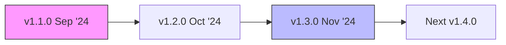

## Overview

Darwin Data tracks your biodiversity footprint with modular tools for assessment, reporting, and strategy design. Review this changelog to see recent updates, bug fixes, and upcoming enhancements. You stay current by checking releases before upgrading your instance or SDK.

<Callout kind="info">
  Subscribe to our RSS feed or GitHub notifications for instant release alerts.
</Callout>

## Recent Releases

<Update label="2024-11-15" description="v1.3.0" tags={["feature", "improvement"]}>

## New Features

- Added **Biodiversity Impact Simulator** module to model scenario-based footprint reductions.
- Introduced API endpoints for bulk data imports from CSV or GeoJSON formats.

## Improvements

- Enhanced dashboard performance by `>40%` for datasets with `>10,000` records.
- Updated risk assessment algorithms with latest IUCN Red List data.

## Bug Fixes

- Fixed export failures for reports exceeding `5MB`.
- Resolved authentication issues in multi-tenant environments.

</Update>

<Update label="2024-10-20" description="v1.2.0" tags={["feature", "bugfix"]}>

## New Features

- Launched **Nature Strategy Planner** with drag-and-drop workflow builder.
- Integrated satellite imagery analysis for habitat monitoring.

## Bug Fixes

- Corrected calculation errors in species richness metrics.
- Patched security vulnerability in legacy API v1 endpoints (upgrade recommended).

## Improvements

- Added customizable report templates with branding support.

</Update>

<Update label="2024-09-10" description="v1.1.0" tags={["feature", "breaking"]}>

## New Features

- Introduced core **Footprint Calculator** with support for 50+ impact categories.
- Added user roles for consultants and enterprise teams.

## Breaking Changes

- Deprecated `v1/auth` endpoint; migrate to `v2/auth` using JWT tokens.

## Bug Fixes

- Fixed dashboard refresh loops in low-bandwidth scenarios.

</Update>



## Upcoming Changes

<Columns cols={3}>
  <Card title="AI-Powered Insights" icon="zap" href="#">
    Machine learning predictions for biodiversity trends.
  </Card>
  <Card title="Expanded Data Sources" icon="database" href="#">
    Partnerships for global habitat datasets.
  </Card>
  <Card title="Mobile SDK" icon="smartphone" href="#">
    On-the-go footprint assessments via React Native.
  </Card>
</Columns>

## Upgrade Guide

Follow these steps to update your Darwin Data SDK or platform instance.

<Steps>
  <Step title="Check Current Version" icon="package">

    Verify your installed version:

    <CodeGroup tabs="Node.js,Python">
      ```javascript
      import { version } from '@darwin-data/sdk';
      console.log(version); // e.g., "1.2.0"
      ```
      ```python
      import darwin_data
      print(darwin_data.__version__)  # e.g., "1.2.0"
      ```
    </CodeGroup>

  </Step>
  <Step title="Backup Data" icon="database">

    Export your projects and assessments:

    ```bash
    darwin-data export --project-id your-project-id --format=zip
    ```

  </Step>
  <Step title="Install Update" icon="download">

    <Tabs>
      <Tab title="npm" icon="package">
        ```bash
        npm update @darwin-data/sdk@latest
        ```
      </Tab>
      <Tab title="pip" icon="python">
        ```bash
        pip install --upgrade darwin-data
        ```
      </Tab>
    </Tabs>

  </Step>
  <Step title="Verify" icon="check-circle">

    Run a test assessment:

    ```javascript
    const result = await darwinData.assessFootprint({
      lat: 40.7128,
      lng: -74.0060,
      radius: 1000
    });
    console.log(result.score); // Should be <1.0 for low impact
    ```

  </Step>
</Steps>

<Callout kind="tip">
  Test updates in staging first. Review migration guides for breaking changes.
</Callout>