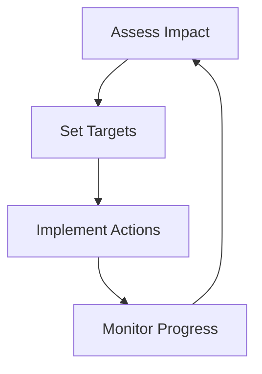

## Overview

Darwin Data empowers you to assess and reduce your organization's biodiversity footprint through a modular platform. This page explains the core concepts, from defining your biodiversity impact to designing effective nature strategies using advanced technologies.

## Defining Biodiversity Footprint

Your biodiversity footprint measures the impact of business activities on ecosystems, species, and genetic diversity. Unlike carbon footprints, it accounts for habitat loss, species extinction risks, and ecosystem service degradation.

<Callout kind="info">
  Biodiversity footprint integrates quantitative metrics like species richness and qualitative factors like ecosystem resilience.
</Callout>

Darwin Data calculates this holistically, helping you identify high-impact areas in your supply chain.

## Key Environmental Metrics

Darwin Data tracks essential metrics to quantify biodiversity impact. Use these to benchmark and prioritize actions.

<Columns cols={3}>
  <Card title="Mean Species Abundance (MSA)" icon="activity">
    Measures habitat integrity on a 0-1 scale, where 1 is pristine.
  </Card>
  <Card title="Red List Index (RLI)" icon="alert-triangle">
    Tracks trends in extinction risk for assessed species.
  </Card>
  <Card title="Ecosystem Condition Score" icon="leaf">
    Evaluates services like pollination and water purification.
  </Card>
</Columns>

| Metric | Description | Scale | Darwin Data Support |
|--------|-------------|-------|---------------------|
| MSA | Habitat degradation percentage | 0-100% | Automated calculation from land-use data |
| RLI | Extinction risk trend | -1 to 1 | Integration with IUCN data |
| Condition Score | Service functionality | 0-100 | Custom weighting models |

## Nature Strategy Design Principles

Follow these principles to build robust nature strategies.

<Steps>
  <Step title="Assess Current Impact" icon="search">
    Map your operations against biodiversity hotspots.
  </Step>
  <Step title="Set Science-Based Targets" icon="target">
    Align with global goals like Kunming-Montreal Framework.
  </Step>
  <Step title="Implement Restoration Actions" icon="growth">
    Prioritize no-net-loss or net-positive-impact commitments.
  </Step>
  <Step title="Monitor and Report" icon="bar-chart-3">
    Track progress with verifiable metrics.
  </Step>
</Steps>



## Role of Cutting-Edge Technologies

Darwin Data leverages AI, satellite imagery, and blockchain for precise assessments.

<Tabs>
  <Tab title="AI Modeling" icon="brain">
    Machine learning predicts species abundance from remote sensing data.

    <CodeGroup tabs="Python,R">
    ```python
    import darwin_data as dd
    msa = dd.calculate_msa(land_use_data="supply_chain.geojson")
    print(f"MSA Score: {msa:.2f}")
    ```
    ```r
    library(darwinData)
    msa <- calculateMSA(land_use_data = "supply_chain.geojson")
    cat(sprintf("MSA Score: %.2f\n", msa))
    ```
    </CodeGroup>
  </Tab>
  <Tab title="Satellite Integration" icon="globe">
    Real-time deforestation monitoring via Copernicus data.
  </Tab>
  <Tab title="Blockchain Verification" icon="shield">
    Immutable audit trails for restoration claims.
  </Tab>
</Tabs>

<Expandable title="Advanced Metrics Customization">
  Customize weights for sector-specific needs, such as agriculture versus mining.

  ```python
  config = {
      "msa_weight": 0.4,
      "rli_weight": 0.3,
      "condition_weight": 0.3
  }
  footprint = dd.compute_footprint(data, config)
  ```
</Expandable>

<Callout kind="tip">
  Start with Darwin Data's free assessment tool to baseline your footprint today.
</Callout>