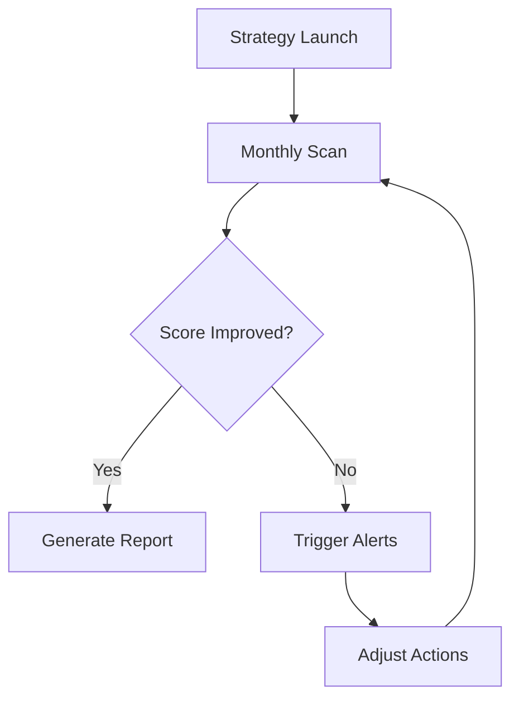

## Modular Tools Overview

Darwin Data provides a suite of interconnected modules to help you assess biodiversity impacts, design reduction strategies, and track progress. Start by selecting the tools that match your business needs.

<Columns cols={3}>
  <Card title="Impact Assessment" icon="zap" href="/docs/assessment">
    Evaluate your operations against biodiversity metrics using satellite data and AI models.
  </Card>
  <Card title="Strategy Builder" icon="settings" href="/docs/strategy">
    Assemble custom action plans with drag-and-drop interfaces and scenario simulations.
  </Card>
  <Card title="Monitoring Dashboard" icon="trending-up" href="/docs/monitoring">
    Real-time tracking of KPIs with automated alerts and compliance reporting.
  </Card>
</Columns>

<Callout kind="tip">
  Begin with the Impact Assessment module to baseline your biodiversity footprint before designing strategies.
</Callout>

## Step-by-Step Strategy Design

Follow these steps to create a comprehensive nature strategy using Darwin Data's modular platform.

<Steps>
  <Step title="Define Objectives" icon="target">
    Set specific goals like reducing habitat loss by `>30%` over five years. Use the Strategy Builder to input targets.
  </Step>
  <Step title="Assess Current Footprint" icon="database">
    Run an automated scan of your supply chain data.
  </Step>
  <Step title="Simulate Scenarios" icon="activity">
    Test reduction pathways with the simulator tool.
  </Step>
  <Step title="Implement Actions" icon="play">
    Deploy workflows and assign tasks to teams.
  </Step>
  <Step title="Launch Monitoring" icon="eye">
    Activate dashboards for ongoing oversight.
  </Step>
</Steps>

## Assessment and Reduction Workflows

Darwin Data supports flexible workflows for biodiversity assessment and footprint reduction. Choose the approach that fits your operations.

<Tabs>
  <Tab title="Assessment Workflow" icon="search">
    Integrate your data sources to generate baseline reports.

    <CodeGroup tabs="JavaScript,Python">
      ```javascript
      import { DarwinClient } from '@darwin-data/sdk';

      const client = new DarwinClient({ apiKey: 'YOUR_API_KEY' });
      const assessment = await client.assessFootprint({
        operations: ['mining', 'agriculture'],
        location: { lat: 40.7128, lng: -74.0060 },
        year: 2023
      });
      console.log(assessment.score); // e.g., 75.2
      ```
      ```python
      from darwin_data import DarwinClient

      client = DarwinClient(api_key='YOUR_API_KEY')
      assessment = client.assess_footprint(
          operations=['mining', 'agriculture'],
          location={'lat': 40.7128, 'lng': -74.0060},
          year=2023
      )
      print(assessment.score)  # e.g., 75.2
      ```
    </CodeGroup>
  </Tab>
  <Tab title="Reduction Workflow" icon="trending-down">
    Apply AI-recommended actions to lower your impact score.

    ```javascript
    const reductionPlan = await client.createReductionPlan({
      targetScore: 50,
      budget: 500000,
      timeline: '5 years'
    });
    ```
  </Tab>
</Tabs>

## Monitoring and Reporting Features

Track your strategy's performance with customizable dashboards and generate compliance reports.

| Feature | Description | Key Metrics |
|---------|-------------|-------------|
| Real-time Alerts | Notifications for threshold breaches | Habitat loss `>5%`, Species impact score |
| Custom Reports | Export PDF/CSV for stakeholders | Progress vs. targets, ROI calculations |
| API Integration | Pull data into your systems | `footprintScore`, `actionCompletion` |



<Expandable title="Advanced Reporting API" default-open="false">
  Use the reporting endpoint for automated exports:

  ```javascript
  const report = await client.generateReport({
    period: 'Q1-2024',
    format: 'pdf',
    include: ['metrics', 'actions']
  });
  ```
</Expandable>

This modular approach ensures you build scalable, data-driven nature strategies tailored to your biodiversity challenges.