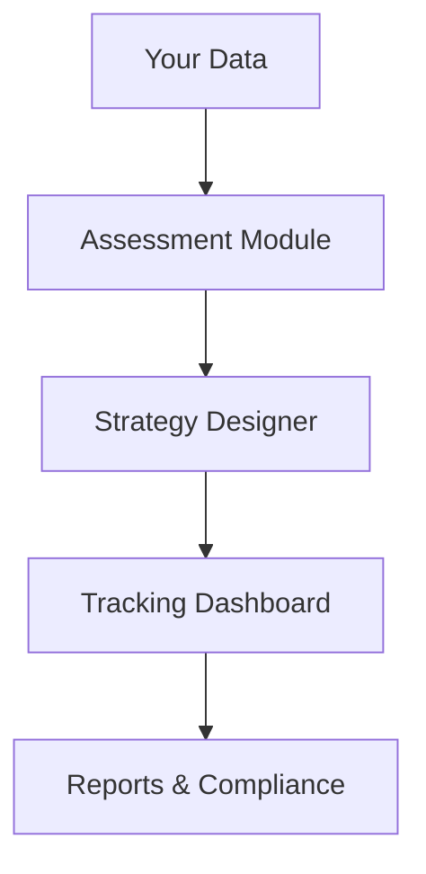

## Overview

Darwin Data empowers businesses and consultants to assess and minimize their biodiversity footprint. You gain access to a modular platform that uses advanced technologies like AI-driven analytics and geospatial data to design comprehensive nature strategies. From impact assessment to restoration planning, the platform guides you through every step.

<Columns cols={3}>
  <Card title="Assess Impacts" icon="target" href="/docs/assessment">
    Quantify your biodiversity effects with precise data models.
  </Card>
  <Card title="Design Strategies" icon="zap" href="/docs/strategy">
    Build tailored plans using modular tools and best practices.
  </Card>
  <Card title="Track Progress" icon="trending-up" href="/docs/tracking">
    Monitor reductions in real-time with interactive dashboards.
  </Card>
</Columns>

## Key Benefits

You benefit from Darwin Data whether you operate as a business leader or consultant. The platform delivers actionable insights tailored to your role.

<Tabs>
  <Tab title="Businesses" icon="building">
    Reduce compliance risks and enhance sustainability reporting. Integrate seamlessly with your ESG workflows to demonstrate biodiversity commitments to stakeholders.
  </Tab>
  <Tab title="Consultants" icon="users">
    Offer clients end-to-end services with white-label modules. Scale your practice by leveraging pre-built assessments and strategy templates.
  </Tab>
</Tabs>

<Callout kind="success">
  Businesses using Darwin Data report an average 25% faster strategy deployment.
</Callout>

## Modular Platform Features

Darwin Data's architecture lets you mix and match components. Core modules include biodiversity calculators, scenario modelers, and restoration planners. You customize your workflow without coding.



<Expandable title="Advanced Integrations" default-open="false">
  Connect to external APIs for satellite imagery or corporate datasets. Use webhooks to sync with your CRM or ERP systems.
</Expandable>

## Get Started

Launch your biodiversity journey in minutes. Follow these steps to set up and explore the platform.

<Steps>
  <Step title="Sign Up" icon="user-plus">
    Create your account at `https://app.darwindata.com/register`. Verify your email to unlock full access.
  </Step>
  <Step title="API Integration" icon="code">
    Generate an API key from your dashboard. Use it to pull data programmatically.
    
    <CodeGroup tabs="JavaScript,Python">
      ```javascript
      const response = await fetch('https://api.darwindata.com/v1/assess', {
        headers: { 'Authorization': 'Bearer YOUR_API_KEY' },
        method: 'POST',
        body: JSON.stringify({ site: 'project-site-123', metrics: ['habitat-loss'] })
      });
      const data = await response.json();
      console.log(data.footprint);
      ```
      ```python
      import requests
      headers = {'Authorization': 'Bearer YOUR_API_KEY'}
      data = {'site': 'project-site-123', 'metrics': ['habitat-loss']}
      response = requests.post('https://api.darwindata.com/v1/assess', json=data, headers=headers)
      print(response.json()['footprint'])
      ```
    </CodeGroup>
  </Step>
  <Step title="Run First Assessment" icon="play">
    Upload site data via the dashboard or API. Review results and generate your initial strategy report.
  </Step>
</Steps>

<Callout kind="tip">
  Start with the free tier to test core modules. Upgrade for unlimited assessments and custom integrations.
</Callout>