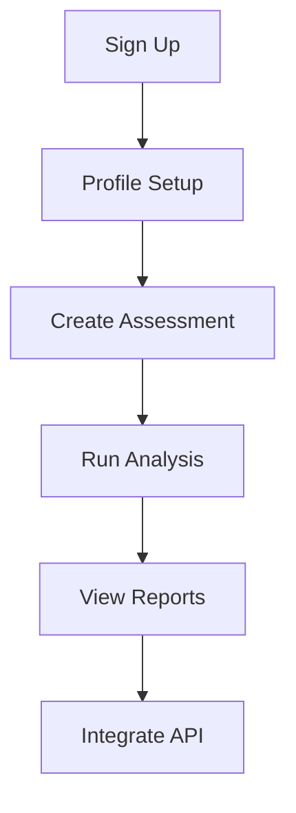

## Overview

Darwin Data provides a modular platform to assess and reduce your biodiversity footprint. Follow these steps to create an account, explore the dashboard, run your first assessment, and generate reports. The process takes under 10 minutes.

<Callout kind="tip">
  Prepare your business details like location, industry, and employee count for accurate assessments.
</Callout>

## Create Account and Log In

Begin by signing up for a free account.

<Steps>
  <Step title="Sign Up" icon="user-plus">
    Visit [app.darwindata.com](https://app.darwindata.com) and click **Sign Up**.

    Enter your email, create a password, and select your role (Business or Consultant).

    Verify your email via the confirmation link sent to your inbox.
  </Step>

  <Step title="Log In" icon="log-in">
    Return to the login page and enter your credentials.

    Enable two-factor authentication (2FA) for security when prompted.
  </Step>

  <Step title="Set Up Profile" icon="settings">
    Complete your profile with company details:

    - Name: Acme Corp
    - Industry: Manufacturing
    - Location: Latitude `52.52`, Longitude `-1.47`
    - Employees: `250`
  </Step>
</Steps>

## Platform Tour

Explore key sections of the dashboard.

<Columns cols={3}>
  <Card title="Dashboard" icon="activity" href="/dashboard">
    View overview metrics and recent assessments.
  </Card>

  <Card title="Assessments" icon="bar-chart-3" href="/assessments">
    Create and manage biodiversity footprints.
  </Card>

  <Card title="Reports" icon="file-text" href="/reports">
    Download PDF and CSV exports.
  </Card>
</Columns>

## Run Your First Biodiversity Assessment

Perform a basic assessment for your operations.

<Tabs>
  <Tab title="Site-Based" icon="map-pin">
    <Steps>
      <Step title="Select Template" icon="file-plus">
        Navigate to **Assessments > New** and choose **Site-Based Footprint**.
      </Step>

      <Step title="Input Data">
        Enter site details:

        ```json
        {
          "siteName": "Factory Alpha",
          "latitude": 52.52,
          "longitude": -1.47,
          "areaHectares": 5.2,
          "habitats": ["grassland", "woodland"]
        }
        ```
      </Step>

      <Step title="Run Analysis">
        Click **Calculate Footprint**. Results appear in `<5` seconds.
      </Step>
    </Steps>
  </Tab>

  <Tab title="Supply Chain" icon="truck">
    Use for indirect impacts.

    ```javascript
    // Example API integration for supply chain data
    const assessmentData = {
      suppliers: [
        { name: "Vendor Beta", volume: 1000, impactScore: 2.3 }
      ]
    };

    fetch('https://api.darwindata.com/v1/assess', {
      method: 'POST',
      headers: { 'Authorization': `Bearer ${YOUR_API_KEY}` },
      body: JSON.stringify(assessmentData)
    });
    ```
  </Tab>
</Tabs>

<Callout kind="info">
  Assessments use AI models trained on global biodiversity data for accuracy `<95%`.
</Callout>

## Access and Export Reports

Review and share your results.

<Steps>
  <Step title="View Results" icon="eye">
    Go to **Assessments > Factory Alpha**.

    Metrics include:

    | Metric              | Value     | Unit       |
    |---------------------|-----------|------------|
    | Species Risk Score  | `3.2`     | Index      |
    | Habitat Loss        | `1.8`     | Hectares   |
    | Reduction Potential | `45%`     | Percentage |
  </Step>

  <Step title="Generate Report" icon="download">
    Click **Export** and select PDF or CSV.

    Share via secure link or email.
  </Step>
</Steps>

<Expandable title="Common Next Steps" default-open="true">
  - Integrate with ERP systems via API
  - Schedule automated monthly assessments
  - Invite team members for collaboration
</Expandable>

## API Quick Integration

For programmatic access, use the REST API.

<CodeGroup tabs="JavaScript,cURL">
  ```javascript
  const apiKey = 'your-api-key-here';
  const response = await fetch('https://api.darwindata.com/v1/reports/123', {
    headers: { 'Authorization': `Bearer ${apiKey}` }
  });
  const data = await response.json();
  console.log(data.footprintScore);
  ```

  ```bash
  curl -H "Authorization: Bearer your-api-key-here" \
       https://api.darwindata.com/v1/reports/123
  ```
</CodeGroup>



You're now ready to reduce your biodiversity footprint with Darwin Data.